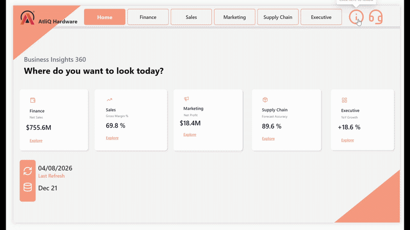
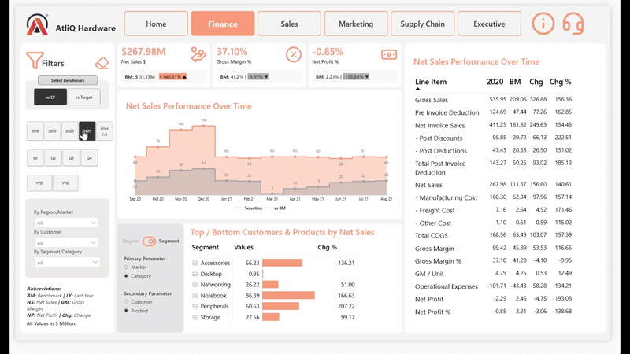
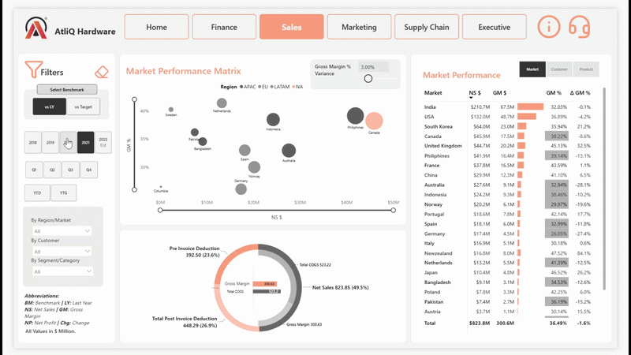
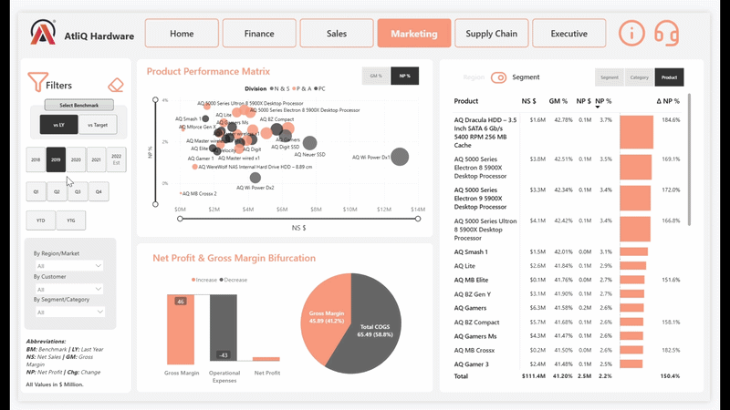
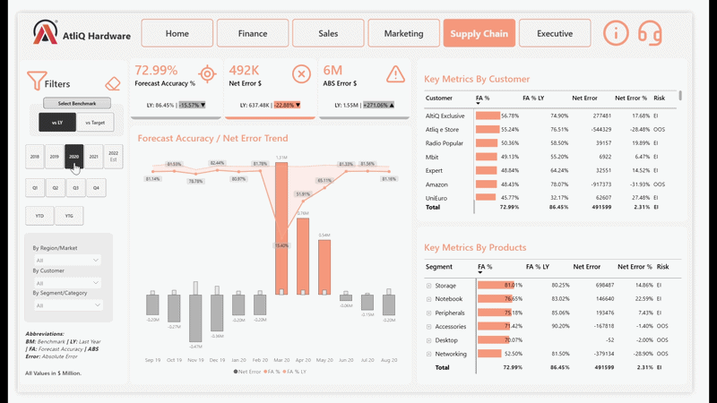
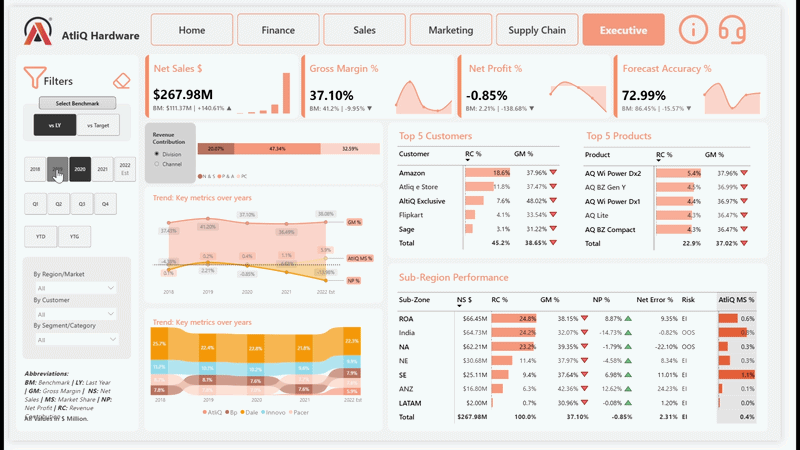

# AtliQ Hardwares — Business Insights 360 📊

> An end-to-end Power BI business intelligence solution designed to provide a 360° view of business performance across Finance, Sales, Marketing, Supply Chain, and Executive Management.

---

## 📌 Project Overview

**Business Insights 360** is a comprehensive Power BI analytics project developed for **AtliQ Hardwares**, a fictional consumer electronics company operating across multiple markets.

The objective of this project is to transform fragmented business data into a centralized, interactive analytics solution that enables stakeholders to monitor performance, identify trends, uncover business challenges, and make data-driven decisions.

The solution brings together multiple business functions into a single Power BI report, providing tailored analytical perspectives for different stakeholder groups.

---

## 🎯 Business Problem

AtliQ Hardwares experienced rapid growth across multiple markets but relied heavily on traditional Excel-based reporting and fragmented analysis.

This created several business challenges:

- Limited visibility into overall business performance
- Inefficient and time-consuming reporting processes
- Difficulty tracking financial and operational KPIs
- Limited visibility into customer and product performance
- Challenges in identifying underperforming markets and segments
- Difficulty monitoring supply chain and forecast performance
- Lack of a centralized business intelligence solution
- Limited ability for management to make timely, data-driven decisions

To address these challenges, a centralized **Business Insights 360** analytics solution was developed using Power BI.

---

# 💡 Solution

The solution provides a unified analytical environment where stakeholders can explore performance across five major business functions:

| Business Function | Key Focus |
|---|---|
| 💰 Finance | Profitability, P & L, and financial performance |
| 📈 Sales | Customer, product, and sales performance |
| 🎯 Marketing | Product, market, and profitability analysis |
| 🚚 Supply Chain | Forecast accuracy and operational performance |
| 🧑‍💼 Executive | High-level business performance and strategic KPIs |

A centralized **Home View** provides intuitive navigation across all major analytical perspectives.

---

# 🛠️ Technology Stack

- **Power BI** — Dashboard development, visualization, reporting, and data modeling
- **DAX** — Measures, KPIs, calculations, and business logic
- **Power Query** — Data cleaning, transformation, and preparation
- **SQL** — Data extraction and data preparation
- **Excel** — Supporting datasets and business inputs
- **DAX Studio** — DAX analysis and performance optimization
- **Git & GitHub** — Version control and portfolio management
- **Git LFS** — Storage of the large Power BI `.pbix` file

---

# 🗃️ Data Sources

The Business Insights 360 solution combines data from multiple sources to create a centralized analytical model for financial, sales, marketing, and supply chain analysis.

## 📁 SQL Databases

### `gdb041` — Sales & Commercial Data

Contains the core transactional and master data used for sales and business performance analysis.

| Table | Description |
|---|---|
| `dim_customer` | Customer master data and customer attributes |
| `dim_market` | Market, region, and country-level information |
| `dim_product` | Product hierarchy and product-related attributes |
| `fact_sales_monthly` | Monthly sales quantity by customer, product, and market |
| `fact_forecast_monthly` | Monthly forecasted quantities used for forecast accuracy analysis |

### `gdb056` — Pricing, Cost & Deduction Data

Contains financial and cost-related information required for profitability and P & L analysis.

| Table | Description |
|---|---|
| `freight_cost` | Freight and logistics-related costs |
| `gross_price` | Gross selling price by product |
| `manufacturing_cost` | Manufacturing cost associated with products |
| `pre_invoice_deductions` | Discounts and deductions applied before invoicing |
| `post_invoice_deductions` | Post-invoice deductions and other adjustments |

---

## 📊 Excel Data Sources

Additional business inputs were provided through Excel datasets and incorporated into the Power BI data model.

| Dataset | Description |
|---|---|
| `targets` | Market-level targets for Net Sales, Gross Margin, and Net Profit |
| `marketshare` | AtliQ Hardwares' market share and competitor market share data |

---

# 🔄 Data Preparation

The source data was prepared and transformed before being incorporated into the Power BI model.

The data preparation workflow included:

- Extracting data from SQL databases
- Importing supporting Excel datasets
- Cleaning and transforming data using **Power Query**
- Standardizing data types and formats
- Handling data preparation and transformation requirements
- Creating relationships between fact and dimension tables
- Developing calculated measures using **DAX**
- Building a centralized analytical data model for reporting

---

# 🧩 Data Model

The transformed datasets are organized into a structured **Snowflake Schema** designed to support efficient analysis across Finance, Sales, Marketing, Supply Chain, and Executive reporting.

### Model Components

The model consists of:

- **Fact tables** — Transactional and measurable business data
- **Dimension tables** — Descriptive attributes for customers, products, markets, and other business entities
- **Supporting datasets** — Targets, market share, pricing, cost, and deduction information

### Entity Relationship Diagram


The model enables analysis across multiple dimensions, including:

- Customer
- Product
- Market
- Region
- Segment
- Time
- Sales
- Forecast
- Pricing
- Costs
- Discounts
- Profitability

---

# 📊 Dashboard Architecture

The Business Insights 360 report consists of the following major views:

```text
                    Business Insights 360
                            │
                        🏠 Home View
                            │
       ┌────────────┬───────┼───────┬──────────────┐
       │            │       │       │              │
    Finance       Sales  Marketing  Supply Chain  Executive

    # 🏠 Home View

The **Home View** serves as the central navigation hub of the Business Insights 360 report.

It provides users with intuitive access to the major analytical perspectives and creates a consistent navigation experience throughout the report.

### Key Features

- Centralized report navigation
- Interactive navigation buttons
- Access to Finance, Sales, Marketing, Supply Chain, and Executive views
- Clean and user-friendly interface
- Consistent navigation experience across the report

### Preview



---

# 💰 Finance View

The **Finance View** provides a detailed overview of the company's financial performance and profitability.

### Key Analysis Areas

- P & L analysis
- Net Sales
- Gross Margin
- Gross Margin %
- Net Profit
- Net Profit %
- Performance trends
- Segment-level analysis
- Market-level performance

This view helps stakeholders understand revenue generation, profitability, and financial performance across different business dimensions.

### Preview



---

# 📈 Sales View

The **Sales View** provides detailed analysis of sales performance across customers, products, markets, and business segments.

### Key Analysis Areas

- Net Sales
- Gross Margin
- Gross Margin %
- Customer performance
- Product performance
- Market performance
- Sales trends
- Segment-level analysis

This view enables users to identify high-performing and underperforming customers, products, and markets.

### Preview



---

# 🎯 Marketing View

The **Marketing View** focuses on product and market-level performance from a marketing and profitability perspective.

### Key Analysis Areas

- Net Sales
- Gross Margin %
- Net Profit
- Net Profit %
- Product performance
- Market performance
- Segment analysis
- Profitability trends

The view helps identify products and markets that contribute positively to overall profitability.

### Preview



---

# 🚚 Supply Chain View

The **Supply Chain View** focuses on operational performance, forecast accuracy, and supply chain efficiency.

### Key Analysis Areas

- Forecast accuracy
- Forecast error
- Net error
- Customer-level analysis
- Product-level analysis
- Comparison with previous-year performance
- Supply chain performance trends

This view helps identify forecasting gaps and areas where operational performance can be improved.

### Preview



---

# 🧑‍💼 Executive View

The **Executive View** provides a consolidated overview of the organization's most important business KPIs.

It is designed for senior management and decision-makers who require a high-level understanding of overall business performance.

### Key Analysis Areas

- Overall business performance
- Revenue and profitability KPIs
- Market performance
- Market share insights
- Product performance
- Customer performance
- Strategic business trends

### Preview



---

# ⚙️ Power BI Features & Techniques

This project incorporates a range of Power BI capabilities to create an interactive and business-focused analytical solution.

## Data & Modeling

- Data cleaning and transformation using Power Query
- Dimensional data modeling
- Snowflake schema
- Fact and dimension table relationships
- Business-oriented KPI design
- Data model optimization

## DAX

- Calculated measures
- Time intelligence
- Filter context
- `CALCULATE`
- Iterator functions
- Dynamic calculations
- Variance and growth analysis
- KPI calculations
- Conditional logic
- Dynamic titles

## Report Interactivity

- Interactive slicers
- Field Parameters
- Dynamic visual switching
- Bookmarks
- Interactive navigation buttons
- Dynamic titles
- Drill-down analysis
- Cross-filtering
- Tooltips
- Conditional formatting

## Performance Optimization

- DAX optimization
- Data model optimization
- Performance analysis using DAX Studio
- Efficient data modeling practices

---

# 📁 Repository Structure

```text
Power-Bi-Business-Insights-360/
│
├── Report/
│   └── Business Insights 360.pbix
│
├── Resources/
│   ├── Data Model.png
│   ├── ExecutiveView.gif
│   ├── FinanceView.gif
│   ├── HomeView.gif
│   ├── MarketingView.gif
│   ├── SalesView.gif
│   └── SupplyChainView.gif
│
├── .gitattributes
└── README.md
# 📚 Project Resources

## Data Model

[View Data Model](./Resources/Data%20Model.png)

## Dashboard Previews

### 🏠 Home View

[View Home View Preview](./Resources/HomeView.gif)

### 💰 Finance View

[View Finance View Preview](./Resources/FinanceView.gif)

### 📈 Sales View

[View Sales View Preview](./Resources/SalesView.gif)

### 🎯 Marketing View

[View Marketing View Preview](./Resources/MarketingView.gif)

### 🚚 Supply Chain View

[View Supply Chain View Preview](./Resources/SupplyChainView.gif)

### 🧑‍💼 Executive View

[View Executive View Preview](./Resources/ExecutiveView.gif)

---

# 🚀 Live Power BI Report

Explore the fully interactive **Business Insights 360** dashboard:

👉 **[View Interactive Power BI Report](https://app.powerbi.com/groups/me/reports/67a42ed1-f24f-4457-92ce-239d8047b5e1/fd8a3ea9e0002b738294?experience=power-bi)**

> Replace `YOUR_POWER_BI_LIVE_LINK_HERE` with your published Power BI report URL.

---

# 📥 Power BI Report File

The complete Power BI report is available in this repository.

👉 **[Download Business Insights 360 — Power BI Report](./Report/Business%20Insights%20360.pbix)**

> **Note:** The `.pbix` file is stored using **Git LFS** due to its large file size.

---

# 📈 Business Outcomes

The Business Insights 360 solution enables stakeholders to:

- Consolidate business reporting into a single analytical platform
- Monitor financial and operational KPIs
- Analyze customer and product performance
- Identify underperforming markets and segments
- Evaluate profitability across different business dimensions
- Monitor supply chain and forecast performance
- Compare current performance with historical results
- Identify business trends and performance gaps
- Improve visibility into overall business performance
- Support faster and more informed decision-making

---

# 🎓 Key Learning Outcomes

This project provided hands-on experience in developing an end-to-end business intelligence solution.

## 💻 Technical Skills

- Power BI report development
- Advanced DAX
- Power Query
- Data modeling
- SQL
- KPI development
- Interactive dashboard design
- Field Parameters
- Bookmarks
- Dynamic titles
- Business-oriented data visualization
- DAX performance optimization
- Git and GitHub
- Git LFS

## 📊 Analytical & Business Skills

- Translating business requirements into analytical solutions
- Defining meaningful KPIs
- Building dashboards for different stakeholder groups
- Identifying business trends and performance gaps
- Presenting insights through data storytelling
- Designing reports with usability and decision-making in mind

---

# 🙏 Acknowledgements

This project was developed as part of the **Codebasics Power BI Data Analytics Course**(https://codebasics.io/courses/power-bi-data-analysis-with-end-to-end-project) and follows a practical, business-oriented approach to developing an end-to-end analytics solution.

Special thanks to the **Codebasics** team for providing the project framework, learning resources, and business case that supported the development of this portfolio project.

---

# 👤 About This Project

**Business Insights 360** demonstrates the application of modern data analytics and business intelligence techniques to transform raw business data into an interactive decision-support solution.

The project combines **SQL, Excel, Power Query, Power BI, DAX, data modeling, visualization, and performance optimization** into a single end-to-end analytics workflow.

---

⭐ **If you find this project useful or interesting, consider giving the repository a star!**
